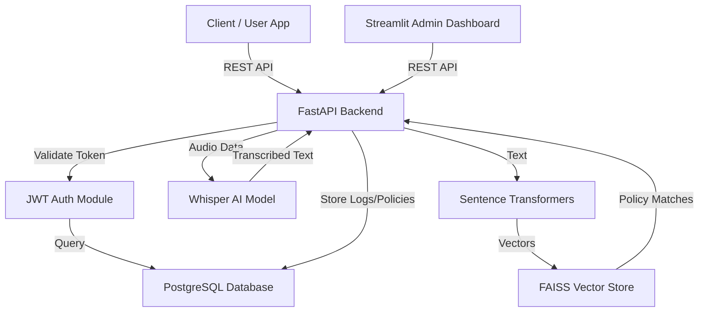
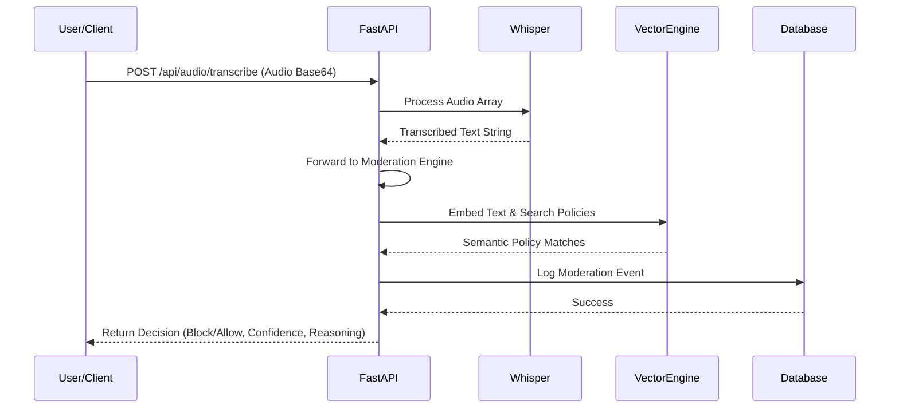
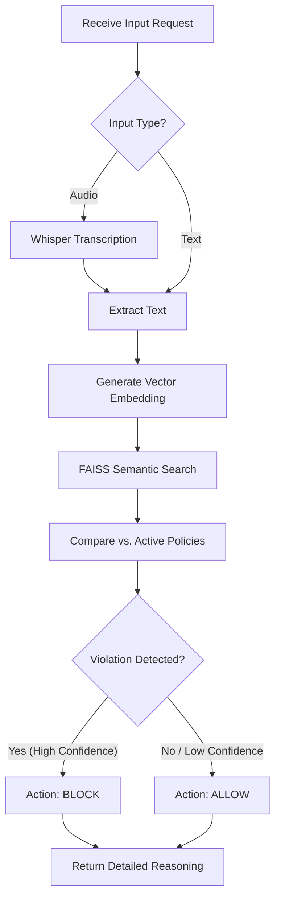
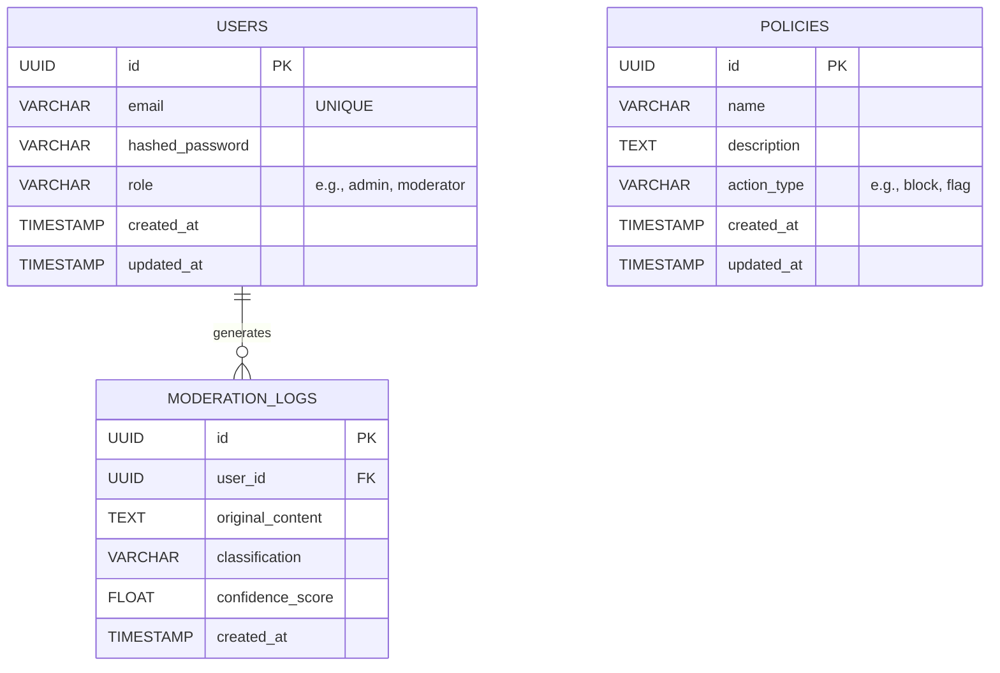

<h1 align="center">🛡️ Hate Speech Detection & Content Moderation System</h1>

<p align="center">
  <b>A powerful, AI-driven full-stack application designed to automatically detect and moderate inappropriate content, enforce policies dynamically, and handle multi-modal inputs (text and audio) at scale.</b>
</p>

<p align="center">
  
  
  
  
  
  
  
</p>

---

## 📋 Table of Contents

- [Problem Statement](#-problem-statement)
- [What We Implemented](#-what-we-implemented)
- [Tech Stack & Why](#-tech-stack--why)
- [System Architecture](#-system-architecture)
- [Application Flow](#-application-flow)
- [Moderation Workflow](#-moderation-workflow)
- [Database Schema Design](#-database-schema-design)
- [Folder Structure](#-folder-structure)
- [Getting Started](#-getting-started)
- [API Endpoints](#-api-endpoints)
- [Future Enhancements](#-future-enhancements)

---

## 🎯 Problem Statement

Online communities and platforms generate massive amounts of user-generated content daily. Moderating this content manually is not only **time-consuming** and **costly**, but it also exposes human moderators to severe psychological toll. 

| Pain Point | Impact |
|---|---|
| **Manual Moderation Bottlenecks** | Teams cannot keep up with real-time content influx, leading to delayed action on toxic behavior. |
| **Multi-Modal Complexity** | Users share not just text, but audio and voice messages, which are notoriously hard to monitor automatically. |
| **Inconsistent Policy Enforcement** | Human interpretation of community guidelines varies, resulting in biased or uneven moderation. |
| **Static Keyword Filters Fail** | Traditional systems rely on static blocklists that users easily bypass using slight misspellings or implicit language. |

### 🔑 Core Question

> *How can we build a unified, automated system that intelligently moderates multi-modal content (text and audio) in real-time, enforcing dynamically updated safety policies using semantic understanding rather than simple keyword matching?*

---

## What We Implemented

### Full-Stack AI Moderation Platform

We built a complete, easy-to-deploy system that connects a fast backend API with an intuitive admin dashboard. The platform is divided into three main parts:

#### 1. Core Moderation Engine
- **Text Analysis**: Automatically reads and classifies text to catch hate speech, toxicity, and rule violations.
- **Audio Processing**: Transcribes uploaded audio files or voice messages into text using OpenAI's Whisper model so they can be accurately moderated.
- **Smart Policy Checking**: Instead of just looking for banned words, the system understands the underlying meaning of the content. It compares the true *intent* of the message against your safety rules to catch hidden violations.

#### 2. Admin Dashboard
- **Live Monitoring**: A clear interface to watch system activity and review flagged content in real-time.
- **Policy Management**: Admins can easily add, change, or remove community rules without needing to write code. The system immediately applies these new rules.
- **Team Access Control**: Built-in user management ensures that only authorized team members can access the dashboard.

#### 3. Platform Infrastructure
- **Secure Access**: Protects your system and data using industry-standard token authentication.
- **Reliable Storage**: Safely stores all user data, active policies, and moderation history in a robust PostgreSQL database.
- **One-Click Setup**: The entire system is packaged with Docker, meaning you can get everything running anywhere with a single command.

---

## 🛠️ Tech Stack & Why

| Technology | Role | Why This Choice |
|---|---|---|
| **FastAPI** | Backend Framework | Async-first, extremely fast, auto-generated OpenAPI docs — ideal for high-throughput AI inference endpoints. |
| **Streamlit** | Frontend Dashboard | Rapid UI development in Python, perfect for internal data-heavy tools and AI dashboards. |
| **PostgreSQL 17** | Database | ACID-compliant, highly reliable relational storage for users, policies, and moderation logs. |
| **OpenAI Whisper** | Audio Transcription | State-of-the-art open-source speech recognition that runs locally for data privacy. |
| **FAISS + Sentence Transformers** | Semantic Search | High-speed similarity search for vector embeddings, allowing the system to match nuanced toxic intent against policies. |
| **SQLAlchemy + Alembic** | ORM & Migrations | Robust database interaction and version-controlled schema evolution. |
| **Docker Compose** | Orchestration | Reproducible multi-service deployment ensuring parity across development and production environments. |

---

## 🏛️ System Architecture



---

## 🔄 Application Flow

### End-to-End Request Lifecycle



---

## 🛡️ Moderation Workflow



---

## 🗄️ Database Schema Design



> **Architecture & Design Decisions:**
> - **Relational Integrity**: PostgreSQL handles core relational mapping (Users ↔ Logs) maintaining strict ACID compliance.
> - **Security & Scaling**: Uses `UUID`s for primary keys to prevent ID enumeration vulnerabilities and ease horizontal scaling.
> - **Dynamic Policy Engine**: `POLICIES` table stores human-readable guidelines, which the background engine syncs into the vector database (FAISS) for semantic inference.

---

## 📁 Folder Structure

```text
HateSpeechDetection_System/
│
├── 🐳 docker-compose.yml           # Orchestrates API and Database
├── 📄 requirements.txt             # Python dependencies
├── 📄 alembic.ini                  # Database migration configuration
│
├── 📂 docker/                       # Dockerfile for FastAPI
│
├── 📂 alembic/                      # Database migrations
│   ├── env.py
│   └── 📂 versions/
│
├── 📂 frontend/                     # ⭐ Streamlit UI Dashboard
│   ├── app.py                       # Dashboard entry point
│   ├── 📂 components/               # Navbar, Auth, Layout
│   └── 📂 pages/                    # specific views
│
└── 📂 app/                          # ⭐ FastAPI Backend Package
    │
    ├── 📄 main.py                   # Application entry point
    │
    ├── 📂 core/                     # Configuration and settings
    ├── 📂 db/                       # SQLAlchemy models & sessions
    ├── 📂 crud/                     # Database access operations
    ├── 📂 schemas/                  # Pydantic validation models
    │
    ├── 📂 api/                      # API Route handlers
    │   ├── 📂 routes/               # auth, moderation, audio, policies, user
    │
    └── 📂 services/                 # Business logic & AI Models
        ├── moderation_service.py    # Core moderation logic
        └── whisper_service.py       # Audio transcription logic
```

---

## 🚀 Getting Started

### Prerequisites

| Tool | Version |
|---|---|
| [Docker](https://docs.docker.com/get-docker/) | 20.10+ |
| [Docker Compose](https://docs.docker.com/compose/) | 2.0+ |
| [Git](https://git-scm.com/) | 2.30+ |

### Installation & Setup (Docker Recommended)

```bash
# 1. Clone the repository
git clone https://github.com/rishabh-singh04/HateSpeechDetection_System.git
cd HateSpeechDetection_System

# 2. Configure environment variables 
# Copy the example.env file and update the values if needed
cp example.env .env

# 3. Build and start all services
cd docker
docker-compose up --build -d

# 4. Access the application
# Backend API Docs: http://localhost:8000/docs
# Frontend Dashboard: http://localhost:8501 (Check specific port binding in use)
```

### Service Ports

| Service | Port | Purpose |
|---|---|---|
| **FastAPI Backend** | `8000` | Main application and API logic |
| **PostgreSQL** | `5432` | Relational storage |
| **Streamlit UI** | `8501` | (If running locally via `streamlit run frontend/app.py`) |

---

## 🌐 API Endpoints

### Authentication & Users
| Method | Endpoint | Description |
|---|---|---|
| `POST` | `/api/auth/login` | Authenticate and receive a JWT token |
| `GET` | `/api/users/` | List system users (Admin) |

### Moderation & Audio
| Method | Endpoint | Description |
|---|---|---|
| `POST` | `/api/moderation/text` | Submit text for hate speech / policy moderation |
| `POST` | `/api/audio/transcribe` | Submit base64 audio data for Whisper transcription |
| `POST` | `/api/audio/transcribe-file` | Upload an audio file directly for transcription |

### Policies
| Method | Endpoint | Description |
|---|---|---|
| `GET` | `/api/policies/` | Retrieve active moderation policies |
| `POST` | `/api/policies/` | Create a new dynamic moderation policy |

---

## 🔮 Future Enhancements

- [ ] 📧 **Automated Alerts** — Send Slack/Discord webhooks for critical violations.
- [ ] 📈 **Advanced Analytics** — Deeper insights into toxicity trends over time within the dashboard.
- [ ] 🧠 **Multilingual Support** — Expand NLP embeddings to accurately moderate non-English content.
- [ ] 🌍 **Edge Deployment** — Lightweight deployment for edge devices to reduce latency.
- [ ] 📱 **Live Video Moderation** — Extend the pipeline to sample and moderate live video streams.
- [ ] 🧪 **Comprehensive Test Suite** — Expand unit and integration test coverage with Pytest.

---

<p align="center">
  <b>Built with ❤️ using FastAPI, Streamlit, and PyTorch</b>
</p>
